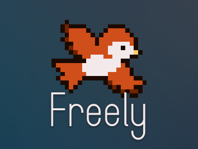

# Freely — decentralized, P2P music player

A decentralized, peer-to-peer music player built with React and TypeScript.

## Tauri (experimental)

This repository includes an experimental Tauri target alongside the existing Electron setup. The Tauri files are minimal and intended to let you try a native build which often produces smaller executables.

Quick run (dev):

```bash
npm install
npm run tauri dev
```

Build (production):

```bash
npm install
npm run tauri:build
```

**See the [Development](#development) and [Building](#building) sections below for comprehensive instructions.**

Notes:
- Tauri requires a Rust toolchain and platform-specific dependencies. See https://tauri.app/v1/guides/getting-started/prerequisites for setup.
- The Tauri config is in `src-tauri/tauri.conf.json` and the minimal Rust entry is in `src-tauri/src/main.rs`.

# Freely — decentralized, P2P music player

<p align="center">
	
</p>

**Freely** is an experimental, web-first music player focused on **peer-to-peer streaming** and **local-first data ownership**.

The idea: stream music directly from other peers, work offline, and carry your playlists, favorites, and settings anywhere.

## Highlights

* **P2P-first streaming** — play music from LAN or WebRTC peers.
* **Local-first** — your data stays with you; export/import anytime.
* **Multi-format** — MP3, FLAC, WAV, OGG, AAC.
* **Customizable UI** — themes, plugins, small-screen mode.
* **Cross-platform** — web, desktop, mobile.

## Current Status

✨ **Prototype** — core P2P transport, local DB, basic UI.
Missing: advanced buffering, robust chunking, polished UX.

## Development

### Quick Start

```bash
npm install
npm run dev
```

This starts the Vite development server for the React frontend and builds the Node.js server bundle.

### Environment Setup

Create a local `.env` (copy from `.env.example`) and add your API credentials:

```bash
cp .env.example .env # then edit values
```

Only variables prefixed with `VITE_` are exposed to the renderer bundle. Keep `GENIUS_CLIENT_SECRET` private.

### Development Commands

| Command | Description |
|---------|-------------|
| `npm run dev` | Start frontend dev server and build server (parallel) |
| `npm run dev:frontend` | Start only Vite dev server |
| `npm run build:server` | Build Node.js server bundle |
| `npm run typecheck` | Run TypeScript type checking |
| `npm run lint:css` | Validate CSS styles with Stylelint |
| `npm run fetch:ytdlp` | Download/update YouTube-DL binary |
| `npm run fetch:bass` | Download/update BASS audio libraries |

### Testing

The project includes several testing and validation approaches:

#### Type Checking
```bash
npm run typecheck
# or directly:
npx tsc --noEmit
```

#### CSS Validation
Validate styles with Stylelint:
```bash
npm run lint:css
# or directly:
npx stylelint "src/**/*.css"
```

Configuration is in `.stylelintrc.cjs` following standard CSS rules.

## Building

### Development Build
```bash
npm run build
```
Creates optimized frontend build and server bundle.

### Production Build
```bash
npm run build:optimized
```
Production-optimized build with environment variables.

### Tauri Desktop App

**Development:**
```bash
npm run tauri dev
```

**Production Build:**
```bash
npm run tauri:build
```

**Release Build:**
```bash
npm run tauri:build:release
```

### Build Requirements

- **Node.js** 18+ and npm
- **Rust toolchain** (for Tauri builds)
- **Platform dependencies** (see [Tauri prerequisites](https://tauri.app/v1/guides/getting-started/prerequisites))

### Build Outputs

| Build Type | Output Location | Description |
|------------|----------------|-------------|
| Frontend | `dist/` | Vite-built React app |
| Server | `src-tauri/server-dist/` | Bundled Node.js server |
| Desktop | `src-tauri/target/` | Native executables |

### Troubleshooting Builds

**Missing binaries:** Run dependency fetchers:
```bash
npm run fetch:ytdlp
npm run fetch:bass
```

**Type errors:** Check with `npm run typecheck`

**Rust compilation issues:** Ensure Rust toolchain is updated:
```bash
rustup update
```

### Spotify API

For richer, high-quality metadata (track durations, preview URLs, popularity, artist genres) the app can use the Spotify Web API (client credentials flow) purely for read-only public data.

Add the following to your `.env` (direct main-process credential flow):

```
SPOTIFY_CLIENT_ID=your_client_id
SPOTIFY_CLIENT_SECRET=your_client_secret
SPOTIFY_DEFAULT_MARKET=US
```

These are used only in the Electron main process to obtain an app access token; secrets are never exposed to the renderer. Search, Track, Album, Artist queries will prefer Spotify where available (future UI integration pending).

#### Recommended: External Token Endpoint (Cloudflare Worker)

To avoid even storing the Spotify client secret locally, deploy a tiny Cloudflare Worker that performs the Client Credentials exchange and returns only `{ access_token, expires_in }`. Then set `SPOTIFY_TOKEN_ENDPOINT` and omit `SPOTIFY_CLIENT_SECRET` from your local `.env`.

Worker example (`src/index.js` in a Worker project):

```js
export default {
	async fetch(req, env) {
		const basic = btoa(env.SPOTIFY_CLIENT_ID + ':' + env.SPOTIFY_CLIENT_SECRET);
		const r = await fetch('https://accounts.spotify.com/api/token', {
			method: 'POST',
			headers: {
				'Authorization': 'Basic ' + basic,
				'Content-Type': 'application/x-www-form-urlencoded'
			},
			body: 'grant_type=client_credentials'
		});
		if(!r.ok){
			return new Response(JSON.stringify({ error: 'spotify_http_'+r.status }), { status: 500, headers:{'Content-Type':'application/json'} });
		}
		const j = await r.json();
		return new Response(JSON.stringify({ access_token: j.access_token, expires_in: j.expires_in }), {
			headers: { 'Content-Type': 'application/json', 'Cache-Control':'public,max-age=240' }
		});
	}
}
```

Deploy steps:
1. `npm install -g wrangler`
2. `wrangler init freely-spotify-token --no-open --type=javascript`
3. Replace generated `src/index.js` with above.
4. Set secrets:
	 - `wrangler secret put SPOTIFY_CLIENT_ID`
	 - `wrangler secret put SPOTIFY_CLIENT_SECRET`
5. `wrangler deploy`
6. Copy the deployed URL and set in `.env`:
	 - `SPOTIFY_TOKEN_ENDPOINT=https://your-worker-subdomain.workers.dev`

In Electron main we read `process.env.SPOTIFY_TOKEN_ENDPOINT`; if present the app fetches the token from there (no secret locally). The Tests tab has a Token Status button that logs debug info (status, body snippet) to help diagnose hosting issues (e.g. HTML challenge pages).

<!-- Electron desktop build instructions removed. Project now targets Tauri for native desktop builds. -->

## Roadmap

1. Better streaming reliability (chunk hashing, multi-peer fetch)
2. Native SQLite for desktop
3. IndexedDB option for web
4. Plugin manager & sandboxing
5. Mobile polish & WebRTC fixes

## CSS / Styling Architecture

Styles have been modularized (see `STYLES.md` for detailed structure). The root `src/styles.css` aggregates partials under `src/styles/` (tokens, base reset, components, feature views, player, background, alerts, tests). Design tokens live in `variables.css` and are consumed via CSS custom properties. Run `npm run lint:css` to validate style rules with Stylelint.

## Why?

I couldn’t find a music player that was P2P, plugin-friendly, customizable, and truly local. So I built one.

---

**License:** MIT

*This is a prototype. Expect breaking changes and rough edges.*
